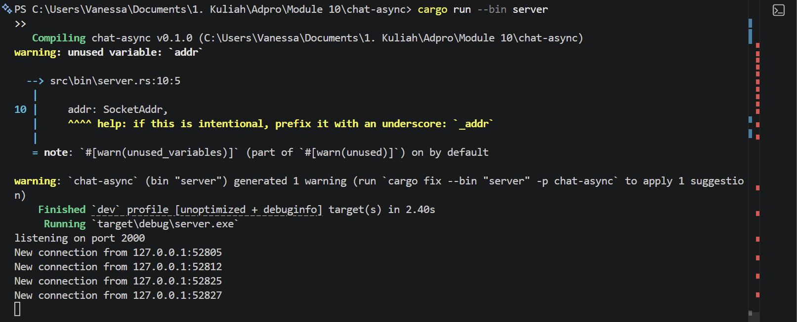
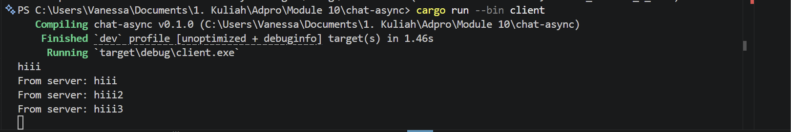
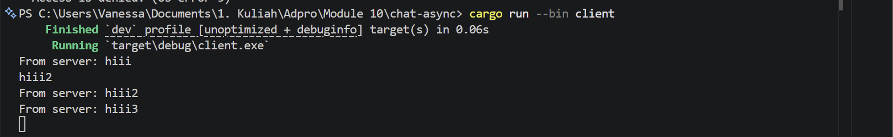
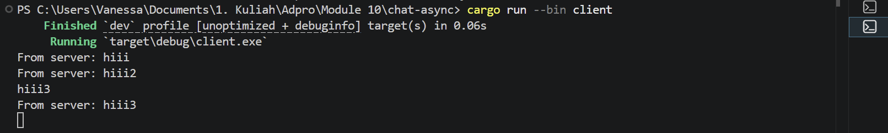
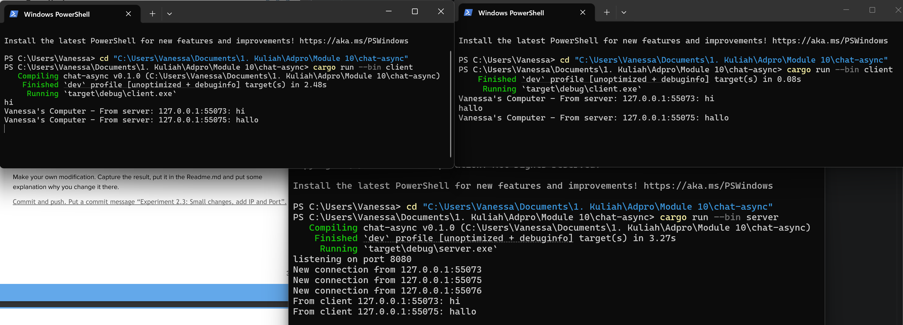
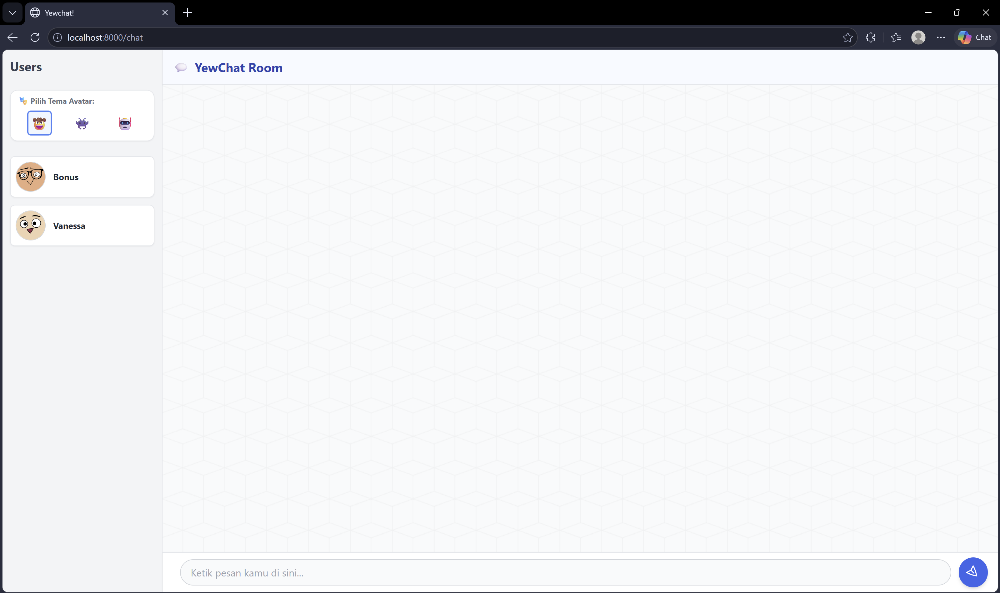
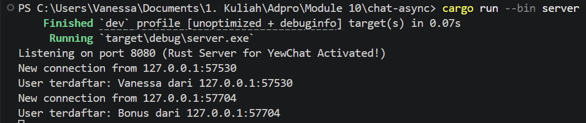

# Reflection

## Original code of broadcast chat

- Koneksi Awal: Saat setiap klien dijalankan, mereka melakukan handshake WebSocket ke alamat 127.0.0.1:2000 yang dikelola oleh server. Server akan mencetak log koneksi baru yang menyertakan alamat IP dan port unik dari setiap klien.  
- Mekanisme Pengiriman Pesan: Ketika kita mengetik teks di salah satu klien, pesan tersebut dikirim melalui stream WebSocket ke server.  
- Proses Broadcast: Server menerima pesan tersebut, lalu menggunakan broadcast channel untuk menyebarkan pesan tersebut ke seluruh klien yang sedang terhubung secara asinkronus.  
- Output pada Klien: Akibatnya, pesan yang diketik oleh satu klien akan muncul di terminal klien lainnya dengan format "From server: [isi pesan]".  
- Asynchronous Processing: Program ini menggunakan tokio::select! sehingga klien dapat terus mendengarkan pesan masuk dari server sambil menunggu input dari pengguna di terminal secara bersamaan tanpa saling memblokir (non-blocking). 

## Modifying the websocket port
Pada eksperimen ini, saya melakukan perubahan nomor port untuk komunikasi WebSocket dari port 2000 menjadi port 8080.Perubahan ini diimplementasikan dengan memodifikasi baris kode TcpListener::bind pada sisi server dan Uri::from_static pada sisi klien. Secara teknis, port berfungsi sebagai titik akhir komunikasi yang spesifik agar data dapat disalurkan ke aplikasi yang tepat di dalam sebuah alamat IP. Jika terdapat perbedaan konfigurasi port antara server dan klien, maka proses handshake WebSocket akan otomatis gagal. Kegagalan tersebut menyebabkan sistem menolak koneksi karena klien mencoba mengakses pintu yang tidak dibuka atau tidak disediakan oleh server. Keberhasilan eksperimen ini membuktikan bahwa sinkronisasi port antar endpoint adalah syarat mutlak dalam membangun koneksi jaringan asinkronus yang stabil.

## Small changes. Add some information to client

Pada eksperimen ini, saya memodifikasi server untuk menampilkan alamat IP dan port pengirim ke dalam setiap pesan yang broadcast. Perubahan ini dilakukan pada fungsi handle_connection dengan menggunakan makro format! untuk menggabungkan variabel addr dan teks pesan.Di sisi klien, saya menambahkan identitas "Vanessa's Computer" pada log terminal. Modifikasi di server bertujuan memberikan identitas pengirim secara otomatis. Penambahan di sisi klien berfungsi sebagai penanda visual untuk memverifikasi bahwa data telah berhasil diterima dan dicetak oleh aplikasi saya. Secara teknis, pemakaian variabel addr ini juga berhasil menghilangkan peringatan unused variable sehingga kode menjadi lebih bersih dan fungsional.

## Bonus: Rust Websocket server for YewChat

### 1. How It Was Done
Untuk menggantikan server Node.js (JavaScript) dengan server asinkronus Ruat, tugas utama yang harus diselesaikan adalah menjembatani protokol komunikasi yang awalnya simple text menjadi payload JSON. Di dalam file `src/bin/server.rs`, saya memanfaatkan *crate* `serde` dan `serde_json` untuk mereplikasi kontrak data yang digunakan oleh *frontend* YewChat (`MsgTypes`, `WebSocketMessage`, dan `MessageData`). Saya juga menggunakan shared state untuk multithreading untuk melacak klien yang terhubung beserta username. Ketika klien terhubung dan mengirimkan payload `Register`, server akan mengekstrak username dan broadcast daftar pengguna aktif yang telah tersinkronisasi melalui *channel* `tokio::sync::broadcast`. Untuk pesan obrolan (`Message`), server mencegat payload yang masuk, membungkus teks tersebut ke dalam struktur sub-JSON `MessageData` bersama dengan nama pengirim yang terautentikasi, lalu mendistribusikannya kembali ke seluruh koneksi yang aktif.

### 2. Why It Is a Successful Change
Karena komunikasi WebSocket pada lapisan paling dasar pada hakikatnya memperlakukan semua payload sebagai data string mentah atau byte buffers. Karena klien YewChat melakukan serialisasi pada struktur data bersarangnya menjadi blok-blok string biasa sebelum mengirimkannya melalui aliran TCP, paket jaringan yang mendasarinya tetap identik. Dengan merekayasa server Rust agar secara presisi dapat parsing payload string tersebut kembali menjadi objek dengan tipe data yang kuat melalui `serde_json::from_str`, klien dan server membangun sinkronisasi dua arah yang lancar.

### 3. Opinion
Secara pribadi, saya memilih versi Rust. Rust memberikan jaminan keamanan kode yang lebih baik. Keamanan tipe data yang ketat dan aturan ownership pada saat kompilasi sepenuhnya mengeliminasi kesalahan memori tipikal dan celah concurrency data races ketika mengelola ribuan koneksi socket secara bersamaan. Sifat deklaratif dari `serde` juga memaksakan validasi skema yang ketat tepat di batas awal masuknya data ke server. Untuk membangun arsitektur perangkat lunak yang tangguh dan memiliki throughput tinggi, abstraksi tanpa beban biaya performa serta efisiensi sumber daya yang dimiliki Rust lebih unggul daripada Node.js.

